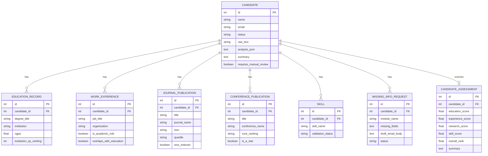
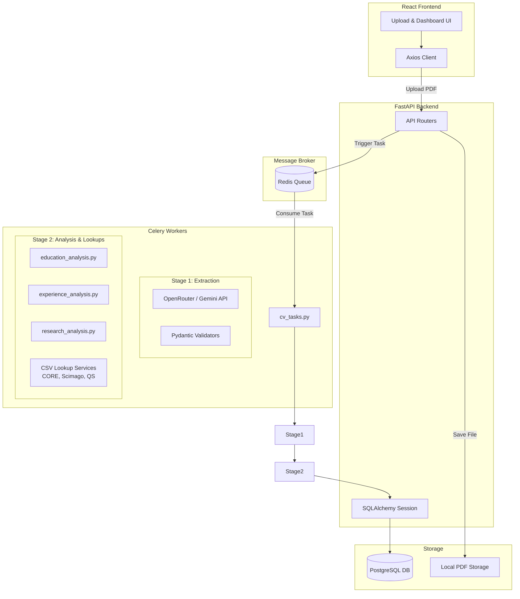

# TALASH v3 System Architecture & Database Schema

Here is a comprehensive breakdown of the entire TALASH v3 project, including the database relationships, the system architecture, and the exact step-by-step flow of how a CV moves through the pipeline.

---

## 1. Database Schema Diagram (ERD)

The system uses a highly normalized relational database built with SQLAlchemy. The `Candidate` table acts as the central hub, with all extracted and analyzed entities linking back to it via foreign keys.

---

## 2. System Architecture

TALASH v3 follows an asynchronous, highly-available microservice architecture.

---

## 3. The CV Processing Flow

This maps exactly how a CV transitions from a PDF into HR-validated actionable insights inside our codebase.

```mermaid
sequenceDiagram
    participant User as Recruiter
    participant API as FastAPI Backend
    participant Worker as Celery Worker
    participant LLM as Gemini / OpenRouter
    participant Lookups as CSV Databases
    participant DB as PostgreSQL

    User->>API: Upload candidate_001.pdf
    API->>DB: Create empty Candidate record
    API->>Worker: Dispatch `process_cv_pipeline` task
    API-->>User: Return status: "processing"
    
    rect rgb(30, 41, 59)
    note right of Worker: STAGE 1: Data Extraction
    Worker->>LLM: Send CV Text with Pydantic Schema
    LLM-->>Worker: Return Structured JSON
    Worker->>DB: Save raw extraction
    end

    rect rgb(15, 23, 42)
    note right of Worker: STAGE 2: Enrichment & Validation
    Worker->>Lookups: Check QS_Rankings.xlsx for Universities
    Lookups-->>Worker: Return Institutional Rank
    Worker->>Lookups: Check scimagojr_2025.csv using ISSN
    Lookups-->>Worker: Return Quartile (Q1/Q2/Q3/Q4)
    Worker->>Lookups: Check CORE.csv using Conference Name
    Lookups-->>Worker: Return Core Rank (A*, A, B, C)
    end

    rect rgb(30, 41, 59)
    note right of Worker: STAGE 3: Analysis & Scoring
    Worker->>Worker: Run `education_analysis.py` (Compute Gaps)
    Worker->>Worker: Run `experience_analysis.py` (Verify trajectory)
    Worker->>Worker: Detect Missing Fields (e.g. Missing Dates)
    end
    
    rect rgb(15, 23, 42)
    note right of Worker: STAGE 4: Synthesis
    Worker->>LLM: Send findings to generate Executive Summary & Draft Emails
    LLM-->>Worker: Return Summary & Drafts
    Worker->>DB: Commit Final Scores & Summaries
    Worker->>DB: Update Candidate Status -> "completed"
    end
    
    User->>API: Load Dashboard
    API->>DB: Fetch Analyzed Data
    DB-->>API: Return Scores & Summary
    API-->>User: Display 3D Visualized Dashboard
```

